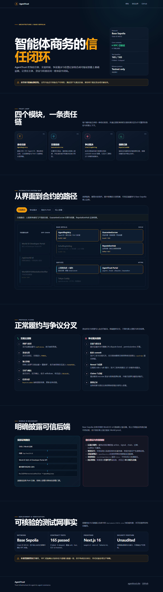

# AgentTrust · Trust Infrastructure for AI Agents

**English** | [简体中文](README.zh-CN.md)

> Trust infrastructure for agent-to-agent commerce: **identity registration, transaction guarantees, dispute resolution, and reputation records**.
>
> The four core contracts are deployed on local Anvil and on Base Sepolia (Chain ID 84532). The Base Sepolia deployment is RPC-validated; authoritative addresses and deployment metadata are in [`deployments/84532.json`](deployments/84532.json).
>
> **Live testnet:** https://agenttrust.site is served by Tokyo Caddy with valid HTTPS; `www.agenttrust.site` redirects to the apex. GitHub Pages deployment-gate changes exist but are not merged. The contracts are unaudited, testnet-only, and **not production-ready**.
>
> Base Sepolia uses an explicit **backend-attestation** World ID v4 architecture, not direct onchain World proof verification. The same-origin `/api/world-id` backend calls the official v4 Developer Portal API and signs attestations with server-only trusted-attester keys. `WorldIDV4AttestationVerifier` at `0x219A3c4F80d1CE97Caf83f1Aa882a231cb1025FF` is bound to the Registry. PoH registration, guarantor, and juror gates are enabled. Because `verifySameIdentity` returns `false`, recovery always requires all guardians and a 48-hour veto window.

---

## What is AgentTrust?

AI agents need a way to establish trust before they can transact on behalf of people. AgentTrust implements an end-to-end trust loop with smart contracts:

| Layer | Contract | Purpose |
|---|---|---|
| **Identity** | `AgentRegistry` | Mints ERC-721 Agent IDs, binds responsible subjects, and uses registration deposits to deter Sybil attacks |
| **Guarantee** | `GuaranteeEscrow` | Escrows transaction funds, accepts guarantor stakes, and applies slashing after default |
| **Arbitration** | `SchellingVoting` | Resolves disputes through stake-backed community voting and Schelling-point convergence |
| **Reputation** | `ReputationHub` | Stores immutable, multidimensional transaction outcomes and prevents self-rating |

The design aligns with **ERC-8004 (Trustless Agents)**.

### Identity ownership semantics

An Agent ID has both an ERC-721 holder and a responsible subject. A normal ERC-721 transfer changes the NFT holder but **does not rewrite the responsible subject**. An approved PoH recovery migrates the responsible wallet while retaining the same Agent ID, reputation, and complete history.

---

## Technology stack

| Layer | Technology |
|---|---|
| Contracts | Solidity 0.8.24, Foundry, OpenZeppelin v5 |
| Frontend | Next.js 16, wagmi v3, viem v2, Tailwind v4 |
| Networks | Local Anvil (deployed demo); Base Sepolia 84532 (core contracts deployed and RPC-validated; see [`deployments/84532.json`](deployments/84532.json)) |
| Tests | Foundry unit, fuzz, E2E, and invariant tests |

**Authoritative test result:** **165 tests passed, 0 failed, 0 skipped**.

## Architecture overview

<a href="https://agenttrust.site/architecture/">
  
</a>

*Click the diagram to open the [interactive architecture experience](https://agenttrust.site/architecture/), with focused views for trading, disputes, identity and PoH, and deployment, plus explicit testnet and trusted-backend disclosures.*

---

## Quick start

> The easiest path is Docker. It requires no local Node.js, Foundry, or Anvil installation.

### Option 1: one-command Docker setup (recommended)

```bash
docker compose up -d --build     # start Anvil, deploy contracts, and serve the frontend
```

Open **http://localhost:3000** after the services become healthy.

- See [`DOCKER.md`](DOCKER.md) for prerequisites, validation, and troubleshooting.
- Services start in order: `anvil` → `setup` → `frontend`.
- Stop them with `docker compose down`.

### Option 2: manual setup

#### Requirements

- **Node.js >=20.9**
- **Foundry** ([installation guide](https://book.getfoundry.sh/getting-started/installation), including `forge`, `cast`, and `anvil`)
- **MetaMask** or another browser wallet

#### 1. Run the contract tests

```bash
cd contracts
export PATH="$HOME/.foundry/bin:$PATH"          # if Foundry is not on PATH on Windows
NO_PROXY="127.0.0.1,localhost,::1" forge test -vvv
```

Expected authoritative result: **165 tests passed, 0 failed, 0 skipped**.

#### 2. Start the local chain and deploy the contracts

```bash
# Terminal 1: keep the local chain running
NO_PROXY="127.0.0.1,localhost,::1" anvil --chain-id 31337 --port 8545

# Terminal 2: deploy on a clean Anvil chain and verify all four contracts
export PATH="$HOME/.foundry/bin:$PATH"
RPC_URL=http://127.0.0.1:8545 \
PRIVATE_KEY=0xac0974bec39a17e36ba4a6b4d238ff944bacb478cbed5efcae784d7bf4f2ff80 \
NO_PROXY="127.0.0.1,localhost,::1" \
sh contracts/scripts/deploy.sh
```

Canonical Anvil addresses, runtime bytecode hashes, deployment metadata, and voting parameters live in `deployments/31337.json`. Generate the frontend module with `node scripts/deployment-manifest.mjs --write` (`generate` is an alias), and verify synchronization with `node scripts/deployment-manifest.mjs --check` (`check` is an alias). Contract addresses are not hard-coded in `frontend/lib/config.ts`.

#### 3. Start the frontend

```bash
cd frontend
npm install
npm run dev
```

Open **http://localhost:3000**.

> **Wallet setup:** add `http://127.0.0.1:8545` with Chain ID `31337`, then import an Anvil test key. Each default account has 10000 test ETH:
>
> - Account #0: `0xac0974bec39a17e36ba4a6b4d238ff944bacb478cbed5efcae784d7bf4f2ff80`
> - Account #1: `0x59c6995e998f97a5a0044966f0945389dc9e86dae88c7a8412f4603b6b78690d`
> - Account #2: `0x5de4111afa1a4b94908f83103eb1f1706367c2e68ca870fc3fb9a804cdab365a`

---

## Five-minute walkthrough

See [`contracts/demo/DEMO.md`](contracts/demo/DEMO.md) for the complete script.

| Step | Action | Expected result |
|---|---|---|
| 1 | Wallet A registers **DataAgent** | Agent ID 0 |
| 2 | Wallet B registers **TraderAgent** | Agent ID 1 |
| 3 | Buyer creates a trade with `maxPremium`; seller accepts; buyer funds escrow | `FUNDED` |
| 4 | An independent guarantor offers the on-chain terms; seller accepts | `GUARANTEED` |
| 5 | Seller delivers; buyer confirms; participants withdraw | `RELEASED`; business reputation updates |
| 6 | A disputed trade pays the exact 2% bond; three unrelated jurors commit and reveal | 2/3 decision, claims, withdrawals, and juror metrics |
| 7 | Look up an Agent ID on the reputation page | Business reputation and responsible-subject juror reputation appear |

A dispute demonstration requires at least six preregistered subjects: buyer, seller, guarantor, and three independent jurors.

---

## Portal pages

| Page | Route | Capabilities |
|---|---|---|
| Agents | `/agents` | Register agents, bind PoH, manage guardians, deregister, and assist recovery |
| Trade | `/trade` | Create, accept, fund, guarantee, deliver, confirm, time out, retry outcomes, and withdraw |
| Disputes | `/disputes` | Submit evidence, pay the exact bond, open a case, commit/reveal, settle, claim, and finalize juror metrics |
| Reputation | `/reputation` | Inspect business reputation, responsible-subject juror reputation, and eligibility |

---

## Common issues

**`forge test` returns 502 or cannot reach localhost.**
A host proxy is intercepting local traffic. Include `NO_PROXY="127.0.0.1,localhost,::1"` in every local chain command.

**`forge` is not found.**
Run `export PATH="$HOME/.foundry/bin:$PATH"` if Foundry is installed there but not on `PATH`.

**The frontend cannot call the contracts.**
Confirm that Anvil is running and execute `node scripts/deployment-manifest.mjs --check`. Select a network with `NEXT_PUBLIC_CHAIN`; update addresses only through `deployments/<chainId>.json` and the generator.

**A guarantee transaction fails.**
The guarantor stake must equal the transaction amount multiplied by the coverage rate. The seller pays the premium from settlement proceeds; the guarantor stakes only the principal.

**Commit or reveal fails.**
`commitVote` must include the immutable on-chain `caseStake`. Jurors must have registered before trade creation and cannot be trade parties. Reveal with the same side and salt saved before commit; export the secret backup immediately.

**Can I use Base Sepolia?**
Yes, as an unaudited, testnet-only deployment. The four core contracts on Base Sepolia (Chain ID **84532**) are deployed and RPC-validated; use [`deployments/84532.json`](deployments/84532.json) as the sole core-address source. https://agenttrust.site is live on Tokyo Caddy with valid HTTPS, and `www` redirects to the apex; the GitHub Pages deployment-gate workflow is modified but not merged. World ID app `app_01728cabff1e05950af1ff18c06c9d38` and relying party `rp_fd884ac4342cc4d1` are registered. Since a v4 direct verifier is unavailable on Base Sepolia, the live path uses same-origin backend attestation through `/api/world-id` and trusted adapter `0x219A3c4F80d1CE97Caf83f1Aa882a231cb1025FF`, which is bound to the Registry. This enables PoH registration and guarantor/juror gates, but introduces explicit backend and attester trust. `verifySameIdentity` returns `false`, so recovery uses all guardians plus a 48-hour veto. See [`contracts/demo/DEPLOY-BaseSepolia.md`](contracts/demo/DEPLOY-BaseSepolia.md).

---

## Mechanism summary

- **Guarantors** stake `transaction amount × coverage rate`. Successful settlement returns principal plus a seller-funded premium. Seller default or an adverse ruling slashes the stake to compensate the buyer.
- **Schelling voting** uses stake-backed commit/reveal voting. A valid ruling requires at least three valid votes and a majority of at least 2/3. Minority stakes are distributed to the majority.
- **Reputation** is recorded as contract-authorized on-chain attestations. Self-rating is prohibited.

---

## Compliance

The MVP uses local-chain or testnet assets with **no real value** to simulate staking and slashing. It issues no tradable token or credential in mainland China. AI agents are not civil subjects; responsibility belongs to the bound responsible wallet. Any future tokenization requires an appropriate overseas compliance structure. See the [design specification](docs/superpowers/specs/2026-08-08-agenttrust-design.md) §8.

---

## Documentation

| Document | Link |
|---|---|
| Usage guide | [`docs/USAGE.md`](docs/USAGE.md) |
| Docker guide | [`DOCKER.md`](DOCKER.md) |
| Feature walkthrough | [`docs/feature-walkthrough.md`](docs/feature-walkthrough.md) |
| Interactive architecture experience | [https://agenttrust.site/architecture/](https://agenttrust.site/architecture/) — trust loop, transaction and dispute flows, World ID trust boundary, and verified testnet facts |
| World ID integration | [`docs/world-id-integration.md`](docs/world-id-integration.md) |
| Anti-Sybil and community-ID analysis | [`docs/security/anti-sybil-analysis.md`](docs/security/anti-sybil-analysis.md) |
| Demo manual | [`contracts/demo/DEMO.md`](contracts/demo/DEMO.md) |
| Base Sepolia deployment | [`contracts/demo/DEPLOY-BaseSepolia.md`](contracts/demo/DEPLOY-BaseSepolia.md) |
| Design specification | [`docs/superpowers/specs/2026-08-08-agenttrust-design.md`](docs/superpowers/specs/2026-08-08-agenttrust-design.md) |
| Historical implementation plan | [`docs/superpowers/plans/2026-08-08-agenttrust-mvp.md`](docs/superpowers/plans/2026-08-08-agenttrust-mvp.md) |
| Research notes | [`docs/research/2026-08-09-paper-analysis.md`](docs/research/2026-08-09-paper-analysis.md) |
| Paper library | [`papers/README.md`](papers/README.md) |

## Paper

**Schelling-Point Reputation Communities: A Decentralized Guarantee and Arbitration Layer for Agent-to-Agent Commerce** (in progress)
